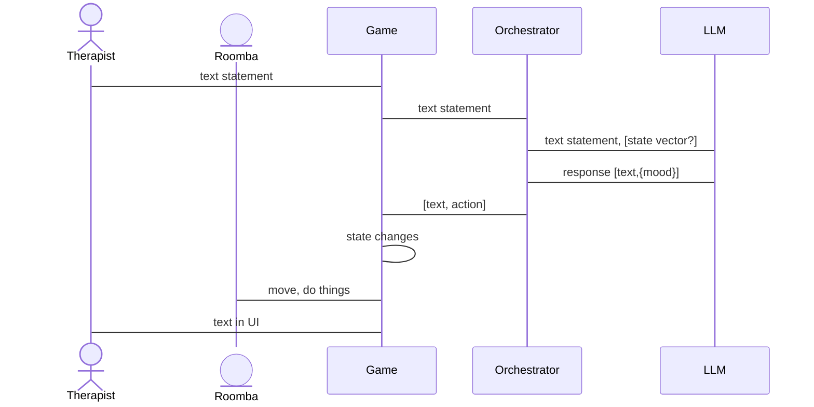
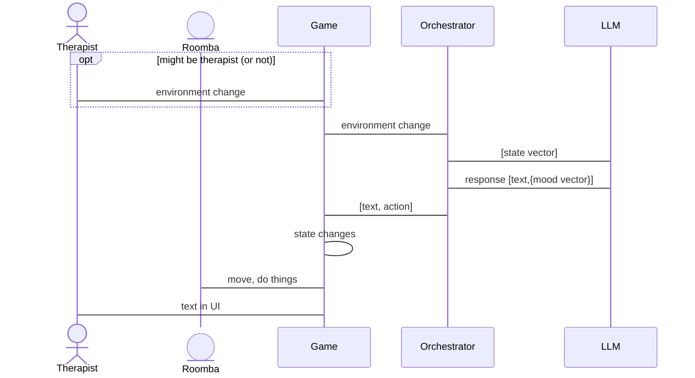

# MSC of the APIs between the players

This is a capture of the interactions between the therapist, the Roomba, the Orchestrator, and the Game that underlies the fundamental game play.

There appear to be two basic patterns at play - either the therapist says something, or something changes in the game arena.   Either of these could cause an interaction with the LLM.   Both flows are similar, but easier to view as seperate flows.

### triggered by therapist dialog

### triggered by state change in the arena

